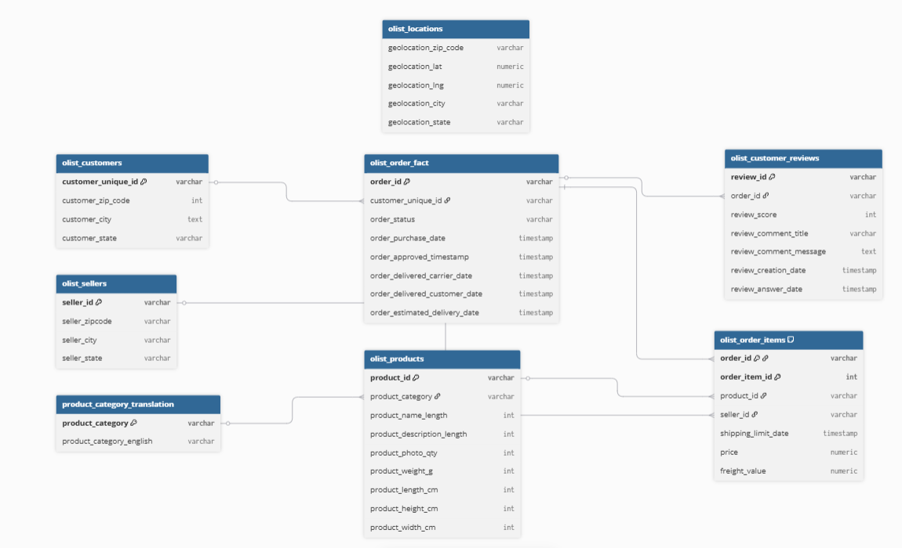
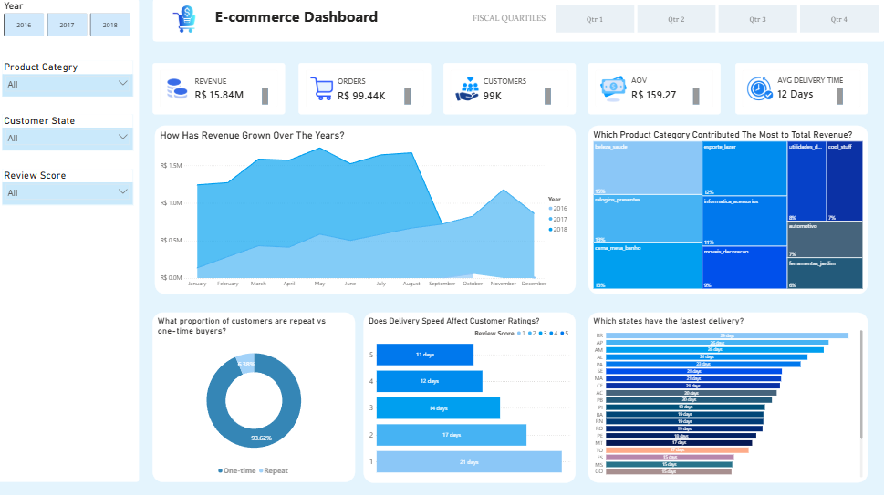

# Olist E-Commerce: Sales, Retention & Delivery Performance Analysis

---

## Background and Overview

Olist is a Brazilian e-commerce marketplace platform that connects small and medium-sized businesses to customers across Brazil. Rather than operating as a direct retailer, Olist functions as a marketplace intermediary, sellers list products through the platform, and Olist handles the customer-facing experience including payments and logistics coordination. The business model means Olist's commercial health depends on two things simultaneously: the volume of orders flowing through the platform, and the quality of the end-to-end customer experience that keeps buyers returning.

As a data analyst working with this dataset, my objective was to move past top-line revenue figures and understand the underlying health of the business. Strong order volume can mask serious structural problems and in this case, it does. The key question I set out to answer was not "how much revenue is the business generating?" but rather "is the business building a customer base, or just processing transactions?"

The analysis is structured around four core areas:

- **Sales Performance** — how is revenue growing, and what is driving it?
- **Customer Retention** — are customers coming back after their first purchase?
- **Customer Satisfaction** — what drives positive and negative reviews?
- **Delivery Operations** — how does logistics performance vary, and what does it cost the business?

The SQL queries used to set up and load the database can be found [here](sql_load/).

Targeted SQL queries addressing specific business questions are organised by theme across four folders: [Customer Behaviour](customer_behaviour/), [Customer Satisfaction & Reviews](customer_satisfaction_reviews/), [Delivery Operations](delivery_operations/), and [Sales Performance](sales_performance/).

An interactive Power BI dashboard used to report and explore performance trends can be found [here](Power_BI_Dashboard\brazilian_Olist.pbix).

---

## Data Structure Overview

The dataset is sourced from the [Brazilian E-Commerce Public Dataset by Olist](https://www.kaggle.com/datasets/olistbr/brazilian-ecommerce) on Kaggle, covering approximately 100,000 orders placed between 2016 and 2018 across multiple Brazilian states. The data has been anonymised with customer and seller references replaced to protect privacy.

The analytical schema consists of one central fact table, three dimension tables, one bridge table, and two supporting tables. The entity relationship diagram is shown below.

- **`olist_order_fact`** — the central fact table. One row per order, containing order status, purchase timestamp, estimated and actual delivery dates, and payment values. This is the primary source for revenue trending, delivery performance, and satisfaction analysis.

- **`olist_customers`** — one row per customer. Contains `customer_id`, `customer_unique_id`, and geographic fields including city, state, and zip code prefix. The distinction between `customer_id` (order-level) and `customer_unique_id` (person-level) is critical for retention analysis — repeat purchases from the same person appear as separate `customer_id` values.

- **`olist_products`** — product catalogue. Contains `product_id`, `product_category_name`, and physical attributes (weight, dimensions). Joined to order items to attribute revenue to product categories.

- **`olist_sellers`** — one row per seller. Contains `seller_id` and geographic location. Used to assess regional seller distribution and logistics performance by origin.

- **`olist_order_items`** — bridge table linking orders to products and sellers. Contains `order_id`, `product_id`, `seller_id`, `price`, and `freight_value`. Required for calculating true order revenue and per-category performance.

- **`olist_order_reviews`** — customer review records. Contains `review_score` (1–5), `review_creation_date`, and optional review text. Joined to orders to correlate satisfaction with delivery outcomes.

- **`olist_geolocation`** — maps Brazilian zip code prefixes to latitude/longitude coordinates. Used for regional delivery and logistics analysis.

---

## Executive Summary

*Power BI dashboard showing revenue trends, category performance, customer retention, and delivery metrics*

Olist generated **R$ 15.84M in revenue across ~99K orders** between 2016 and 2018, with growth driven almost entirely by increasing order volume rather than improving customer value. The business has a serious retention problem: **~97% of customers purchase only once**, meaning the platform is almost entirely dependent on new customer acquisition to sustain revenue growth. This is expensive and structurally fragile.

The data also reveals a clear link between delivery experience and customer satisfaction, customers who receive delayed orders give significantly lower reviews, and this effect is strongest among high-value buyers,the exact customers the business can least afford to lose. Delivery times vary dramatically by region, ranging from ~9 days in faster states to ~29 days in slower ones, creating an uneven customer experience that compounds the retention problem.

The core issue is this: **Olist is optimised for transaction volume, not customer relationships** — and the data shows exactly what that costs.

---

## Insights Deep Dive

### Sales Performance

- **Revenue growth is real, but it is driven by more customers — not better monetization.** Order volume is the primary engine of revenue growth across the 2016–2018 period. Average order value (R$ 159.27) has remained relatively stable, meaning the business is not extracting more value per customer over time, it is simply acquiring more of them. Growth without improving monetization is a fragile foundation.

- **A small number of product categories generate disproportionate revenue.** Category performance is highly uneven. A handful of high-AOV categories account for the majority of platform revenue, while the long tail of low-performing categories contributes comparatively little. Average order value varies significantly across categories, meaning some segments are worth far more per transaction than their order volume alone suggests.

- **High-frequency categories do not always correspond to high-value ones.** Understanding both order volume and average order value together is essential for making sound decisions about where to focus marketing and seller recruitment efforts. Optimising for volume alone risks over-investing in low-margin segments.

- **Revenue is concentrated — a minority of categories and sellers drive the majority of platform income.** This concentration is both an asset and a risk: it creates clear focus areas for investment, but also means the business is exposed if top-performing segments soften.

---

### Customer Retention

- **96.9% of customers never return after their first purchase.** This is the single most important finding in the entire analysis. Only 3.1% of customers place a second order, meaning for every 100 customers Olist acquires, it retains fewer than 4. The business is running an acquisition treadmill — every unit of revenue growth requires a proportional increase in new customer spend, with no compounding effect from a loyal base.

- **High-value customers are not returning either.** Repeat purchase failure is not limited to low-spend customers. High-value first-time buyers churn at the same rate as everyone else, ruling out price sensitivity as the explanation. The data points instead to a structural absence of retention mechanics — no loyalty programs, no post-purchase nurture, no incentive to return.

- **The average number of orders per customer is close to 1.** This is not a rounding issue — it reflects genuine one-and-done behaviour across the customer base. Without intervention, the ceiling on customer lifetime value remains extremely low regardless of how much acquisition spend increases.

- **Marketing spend is structurally inefficient under the current model.** With near-zero retention, the cost of acquiring each unit of revenue is fixed and high. A modest improvement in repeat purchase rate would have an outsized impact on overall marketing ROI and revenue sustainability.

---

### Customer Satisfaction

- **Delivery time is the dominant driver of customer satisfaction — not product quality or price.** Customers who leave 1-star reviews experience delivery times approximately twice as long as those who leave 5-star reviews. The relationship between delay and dissatisfaction is consistent and clear across the dataset.

- **High-spending customers are the most sensitive to poor delivery.** The customers generating the most revenue per transaction are also the most likely to leave low ratings when delivery underperforms. This creates a compounding risk: the highest-value segment is also the most at-risk when operations fail.

- **Average review scores are generally positive when delivery works.** The platform is capable of delivering high satisfaction; the issue is operational consistency. Product quality and the core shopping experience are not the problem — the platform fails its customers at the logistics layer, not the product layer.

- **Dissatisfaction is predictable and therefore preventable.** Because delivery delay is the primary driver of low scores, the conditions that produce 1-star reviews can be identified before they occur — flagging at-risk orders for proactive communication or expedited handling would reduce negative reviews without requiring product changes.

---

### Delivery Operations

- **Delivery performance varies dramatically by region — from ~9 days to ~29 days.** The national average of 12 days obscures enormous regional disparity. Customers in slower-served states receive a fundamentally different experience from those in faster regions, directly translating into lower satisfaction scores and higher churn probability.

- **Late deliveries are concentrated in specific regions and are addressable.** The split between late and on-time deliveries is not evenly distributed — it clusters in specific areas tied to warehouse proximity and carrier coverage. This means targeted intervention is more effective than a platform-wide approach.

- **Delivery inconsistency is as damaging as outright delays.** Customers form expectations based on estimated delivery dates shown at checkout. When actual delivery diverges from estimates — even if the total time is reasonable — satisfaction drops. Expectation management is as important as raw speed.

- **The gap between estimated and actual delivery dates is a controllable variable.** Improving the accuracy of delivery estimates at checkout — rather than just improving raw delivery speed — would reduce perceived failures and improve satisfaction scores even before logistics infrastructure is upgraded.

---

## Recommendations

Based on the insights and findings above, we would recommend the Marketing, Product, and Operations teams to consider the following:

- **96.9% of customers never return — retention must become a strategic priority, not an afterthought.** The platform currently has no meaningful retention mechanics. Introducing post-purchase email sequences, first-to-second purchase incentives, and loyalty programs specifically targeting high-value first-time buyers would directly address the most structurally damaging finding in this analysis.

- **Delivery time is the single largest driver of dissatisfaction — prioritise speed and reliability for high-value orders.** Since high-spending customers are the most sensitive to delivery failures, a tiered fulfilment approach (prioritising expedited handling for orders above a certain value threshold) would protect the revenue segment most at risk while managing logistics costs efficiently.

- **Regional delivery variance of up to 20 days between states is creating a two-tier customer experience.** Targeted investment in regional warehousing or improved carrier partnerships in the slowest-performing states would compress delivery times where the problem is most acute and the retention impact is greatest.

- **Revenue growth depends entirely on acquisition — this is not sustainable.** Marketing budget allocation should shift meaningfully toward retention and reactivation. Acquiring a customer who never returns has a far lower ROI than reactivating a lapsed buyer or extending the relationship of an existing one. Customer lifetime value (LTV) should replace order volume as the primary growth metric.

- **A small number of product categories drive disproportionate revenue — double down on them.** Marketing campaigns, seller recruitment, and platform promotion should be concentrated on the highest-AOV, highest-volume categories. Low-performing categories should be reviewed for strategic fit and potentially deprioritised to focus platform resources where they generate the most return.

---

## Assumptions and Caveats

Throughout the analysis, multiple assumptions were made to manage challenges with the data. These assumptions and caveats are noted below:

- The dataset covers 2016–2018 only. The 2016 data is sparse (Olist launched mid-year), so year-over-year trend analysis is based primarily on 2017–2018 comparisons.
- Customer retention is measured using `customer_unique_id` to identify the same individual across multiple orders. The raw `customer_id` field is order-scoped and would overstate churn if used directly.
- Churn is implicitly defined by the absence of a second purchase within the dataset window. Some customers classified as one-time buyers may have repurchased after the 2018 data cutoff.
- Delivery performance metrics are based on the difference between `order_purchase_timestamp` and `order_delivered_customer_date`. Orders with null delivery dates (cancelled or undelivered orders) were excluded from delivery time calculations.
- Revenue figures use `payment_value` from the payments table, which includes freight. Net product revenue figures would be slightly lower after freight deduction.
